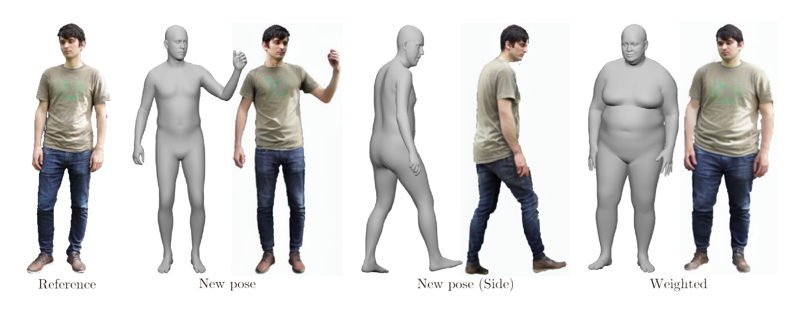

# DiffBody: Diffusion-based Pose and Shape Editing of Human Images
<p align="center">

</p>
  <a href="https://arxiv.org/abs/2401.02804"></a>

This repository contains our implementation of the following paper:
Yuta Okuyama, Yuki Endo, Yoshihiro Kanamori: "Diffbody: Diffusion-based Pose and Shape Editing of Human Images", accepted to WACV2024.  [[Project](https://www.cgg.cs.tsukuba.ac.jp/~okuyama/pub/diffbody/index.html)][[Paper](https://arxiv.org/abs/2401.02804)]

We are preparing for releasing code.

## Milestones
- [ ] Release code for inference (ETA: ~1/12) 
- [ ] Release code for data creation (ETA: ~2/1) 


## Citation
Please cite our paper if you find the code useful:
```
@InProceedings{Okuyama_2024_WACV,
    author    = {Okuyama, Yuta and Endo, Yuki and Kanamori, Yoshihiro},
    title     = {{DiffBody}: Diffusion-Based Pose and Shape Editing of Human Images},
    booktitle = {Proceedings of the IEEE/CVF Winter Conference on Applications of Computer Vision (WACV)},
    month     = {January},
    year      = {2024},
    pages     = {6333-6342}
}
```
